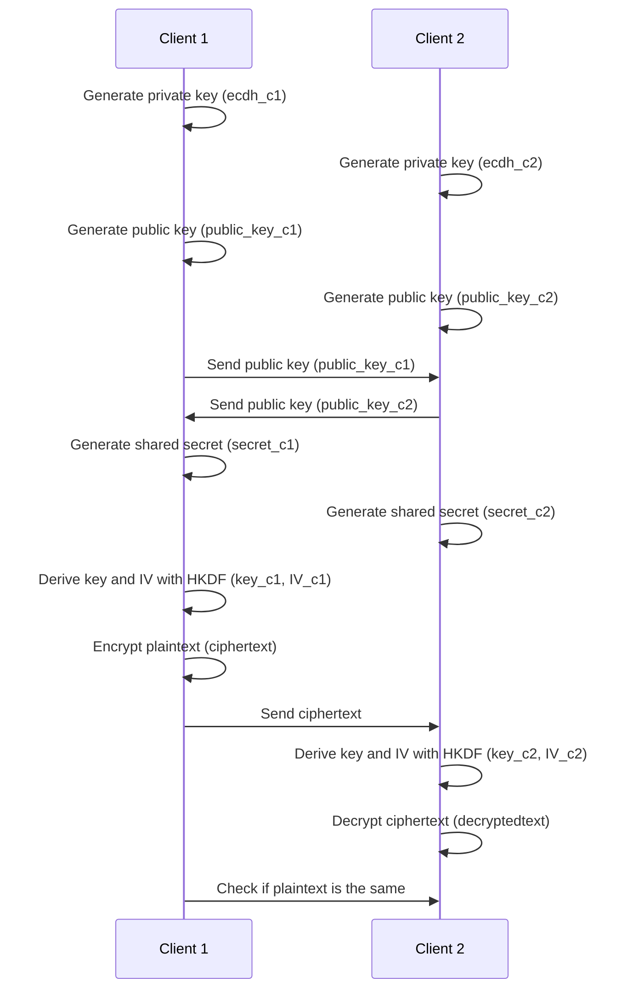

# ECDH demo

This script demonstrates the Elliptic Curve Diffie-Hellman (ECDH) key exchange protocol using the NIST384p curve.
It generates a shared secret between a server and a client, and checks if the shared secrets are the same.

Dependencies:
```bash 
pip install cryptography ecdsa
```

The file performs the following operations to demo the use of ECDH:
1. C1 and C2 generate their own private keys
2. C1 and C2 generate their own public keys
3. C1 and C2 load the public keys of the other party
4. C1 and C2 generate the shared secret
5. C1 and C2 derive a key and an IV from the shared secret using HKDF
6. C1 encrypts a plaintext using AES CBC with the derived key and IV
7. C2 decrypts the ciphertext using AES CBC with the derived key and IV
8. C1 and C2 check if the decrypted plaintext is the same as the original plaintext


The sequence of operations is illustrated below:


